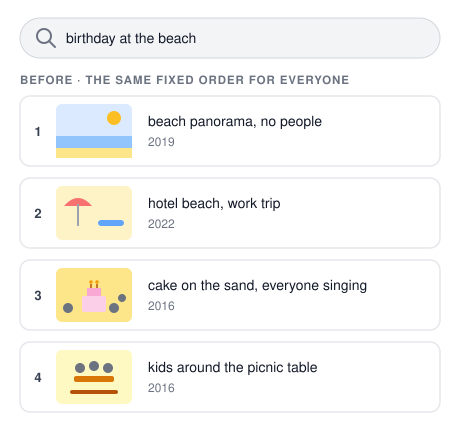
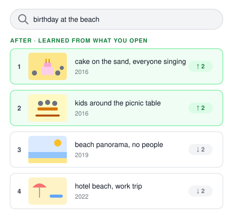
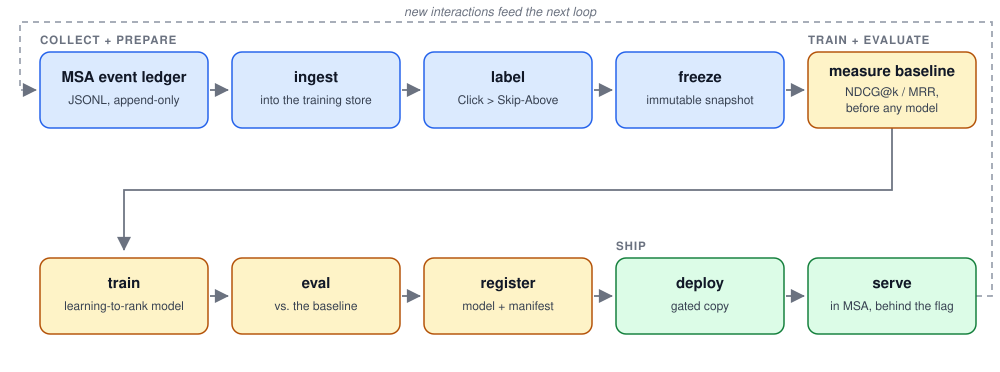
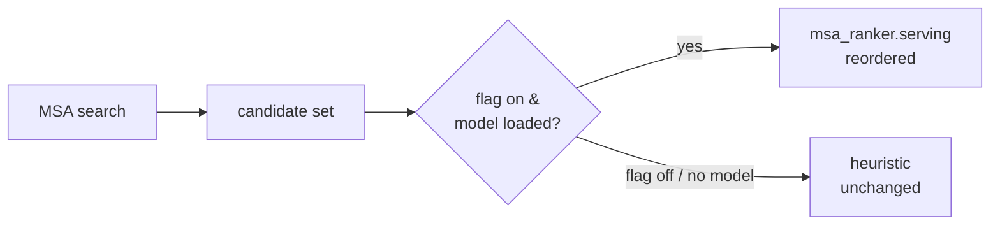

# msa-ranker

A non-LLM supervised **learning-to-rank model** that reorders the
[media-search-agent](https://github.com/openara-ai/media-search-agent) (MSA) app's
search result set using features of each result + the query, trained on the user's own
logged interactions, served inside MSA. Developed using
[Agentic Engineering](docs/agentic-development.md).

📖 **The story:** every [openara.ai](https://github.com/openara-ai) project gets its
build story on [The Agentic Notes](https://theagenticnotes.substack.com); the ranker's
story will follow once the loop closes on real usage. MSA's is
[already up](https://theagenticnotes.substack.com/p/discovering-forgotten-moments).

## Why this exists

MSA is about **rediscovering memories you've forgotten you have**: the photo from a
trip years ago, or the clip of someone who's no longer around. You search your own
media the way you'd describe it, not by filename or folder. Semantic search is what
makes that possible: it finds the *right set* of candidates even when your words don't
match any metadata.

But finding the right photos is only half the job. They come back in the **same fixed
order for everyone**, so the one you actually want can end up far down the list where you
never scroll. If you can't see it, it might as well not be there.

The ranker solves that second half: it **learns what you like** from how you click on
search results. Each time you pick a result, that's a hint about what matters to you, and
the ranker uses those hints to move the photos you're most likely to want up to the top,
where you'll see them first.

Here is the idea with a made-up example. You search **"birthday at the beach"**, and
over the past months you have mostly been opening the older photos, the
further-back memories:

<!-- markdownlint-disable MD033 -- inline HTML is the only way to size the two panels side by side on GitHub -->
<p align="center">
  
  
</p>
<!-- markdownlint-enable MD033 -->

Both panels show the same four photos. Retrieval did not change; the ranker only moved
the ones you tend to open to the top.

It is designed to be safe. It **only reshuffles** the results MSA already found. It never
changes what gets searched, and if anything goes wrong it falls back to the normal order.
So it cannot break search itself; ranking quality is measured against the baseline
rather than guaranteed for every query.

## What it is

The ranker is an offline-trained, learned (non-LLM) **learning-to-rank reranker**, built
as a complete **MLOps loop**: an append-only event ledger feeds ingestion, labeling,
training, evaluation, and registration, and a gate-passing model is deployed and served
behind a flag.

- **Reorders only**: never changes retrieval, never writes MSA's index.
- **Off ≡ MSA today**: flag-off ordering is byte-identical to the heuristic; a
  missing/broken model falls back safely.
- **Pure-Python, zero runtime dependencies**, cross-platform (macOS/Linux/Windows).
  Trains offline on CPU; serves a small portable model artifact in-process.
- **Local-first and private**: learns from a local, append-only interaction ledger
  that MSA never transmits anywhere and that is never committed to a repository.
  See *Privacy* below.

## The MLOps loop

Training is offline, manual, and CPU-only. The diagram shows the pipeline stages, and
the whole pipeline is golden-tested end-to-end. Four stages are `msa-ranker`
subcommands (`ingest`, `train`, `report`, `deploy`); the other stages run inside
`train` and are not standalone commands.



The loop is deliberately small and repeatable. MSA writes search-and-open events to a
local append-only ledger. `msa-ranker` ingests them into its training store, derives
Click > Skip-Above labels, freezes an immutable dataset, and measures the existing heuristic
baseline. It then trains a model and evaluates it against that bar. Every trained
model is registered with its manifest and metrics, failed experiments included; the
deployment gate passes only models that beat the baseline, and the deployed model is
served in-process behind MSA's feature flag, where new interactions start the next
loop.

The learned model stays out of the correctness path: flag handling, fallback, and
feature extraction are golden-tested; model quality is judged offline against the
pre-training baseline.

**Running it:** the [runbook](docs/runbook.md) walks the manual operator steps
end-to-end (train, review the registry, deploy, enable); each stage's behaviour is
specified under [docs/specs/](docs/specs/) (see [Documentation](#documentation)).

## How it fits MSA

MSA imports `msa_ranker` as an **optional** dependency behind a guarded import: with
the package absent or the flag off, MSA runs exactly as it does today. Installed and
enabled, the reranker logs interactions, and a model trained on them reorders results.



The public, SemVer-governed contract is `msa_ranker.serving` / `.ledger` / `.features`.

## How MSA consumes it

MSA imports `msa_ranker` as an optional dependency and turns it on through config;
MSA consumes the wheel (vendored during development, switching to a pinned
release-asset URL once the first public release is promoted), and the same wheel
ships the `msa-ranker` CLI, so operating the loop never requires this repo. Current MSA already ships the integration: the rerank seam plus the
interaction-logging hooks (the `search_id` echo and `POST /track/open`) that produce
the ledger.

The arrangement has four steps: MSA logs interactions to the local ledger
(`ranker.event_logging`, on by default, `false` to collect nothing); you train
offline with the CLI; a gate-passing model is deployed into MSA's
`ranker.ltr_model_dir`; and one flag serves it:

```yaml
ranker:
  enable_learning_to_rank: true   # master flag, default OFF (search byte-identical, INV-3)
  ltr_model_dir: <deployed model dir>
```

If the flag is off, the model is missing, or the load gate fails, MSA serves the
heuristic unchanged and search still starts; flip the flag back and restart for an
instant return to today's ordering.

**Hands-on steps are documented in one place:** [Getting Started](docs/getting-started.md)
covers both workflows (use a release with your MSA, or develop this package), and the
[runbook](docs/runbook.md) owns the recurring operator loop (train → review → deploy
→ enable → rollback).

## Layout

- `src/msa_ranker/`: the library + `msa-ranker` CLI (`ingest`, `train`, `report`,
  `deploy`).
- `src/msa_ranker/migrations/`: additive SQL migrations for the training
  system-of-record (packaged with the wheel).
- `tests/`: golden + contract tests.
- `docs/`: design docs and specs (see [Documentation](#documentation)).

## Documentation

### Guides

- [Getting Started](docs/getting-started.md): first-run walkthrough to set up, verify, and run the loop once
- [Architecture](docs/architecture.md): topology, the two data flows, the SoR schema
- [Runbook](docs/runbook.md): the manual operator loop to train, review, deploy, enable
- [Requirements](docs/requirements.md): scope, FR-1…18 / NFR-1…10, acceptance, non-goals
- [Feature specs](docs/specs/): per-stage behaviour + `AC-nn.x` acceptance (ledger,
  features, labels, eval, registry, serving, ingest)

### Engineering references

- [Agentic Development](docs/agentic-development.md): how this project was built (the workflow spine, ADRs, the review mesh, guardrails)
- [Research](docs/research.md): the time-boxed investigation behind the chosen approach (what fed the ADRs)
- [Architecture Decision Records](docs/adrs.md): the fourteen ADRs (ADR-001…014) governing this codebase
- [Invariants](docs/invariants.md): INV-1…10, the binding non-negotiables
- [Testing](docs/testing.md): the golden-test + offline-eval strategy

## Dev

Working on the package itself? [Getting Started](docs/getting-started.md) covers the
setup: clone, editable install, and the same fail-closed gates CI runs
(`ruff` → `black --check` → `pytest`).

## Privacy

When MSA is configured to use the reranker, it appends a local, append-only event
ledger (searches shown + opens) in MSA's own data area. Logging is **on by default**
so the reranker can learn. The app **never transmits the ledger anywhere**, and it is
never committed to a repository; if you choose to train on a separate machine,
copying the ledger there is a manual step the operator performs and controls (see the
[architecture](docs/architecture.md) handoff section). Disable all logging with
`ranker.event_logging: false`. Raw query text and media/person references stay in the
private local store and are never exported.

## Status

`msa-ranker` is pre-release, experimental software developed through human-led,
AI-assisted agentic coding. Expect the API and docs to change. See the
[CHANGELOG](CHANGELOG.md) for details.

## Contributing

Bug reports and issues are the most useful contribution right now: reranking results
that look wrong, integration friction with MSA, and documentation gaps. The project is
design-first, so please read [CONTRIBUTING.md](CONTRIBUTING.md) and open an issue
before sending a non-trivial PR.

## License

[MIT](LICENSE). Built with [agentic engineering](docs/agentic-development.md) under the
[openara.ai](https://github.com/openara-ai) project.
