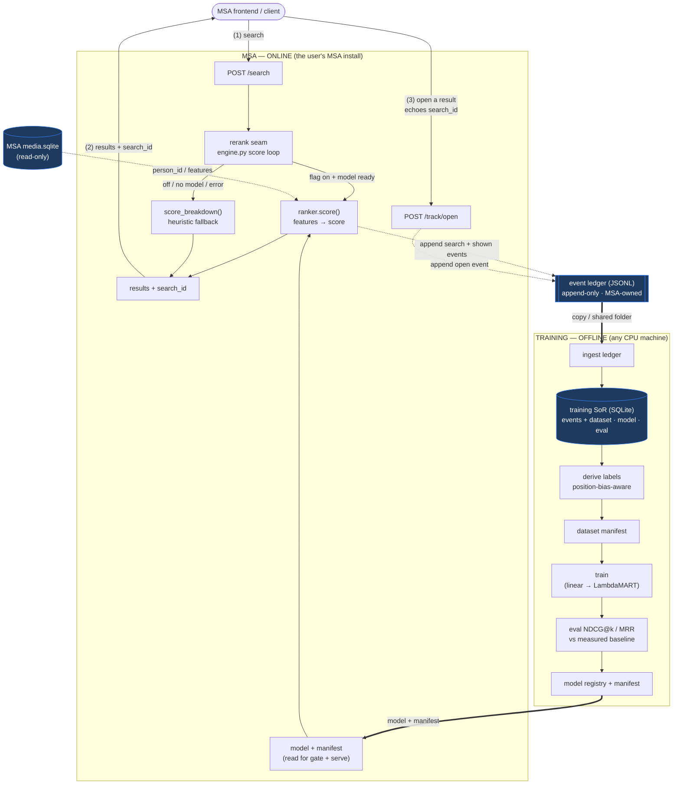
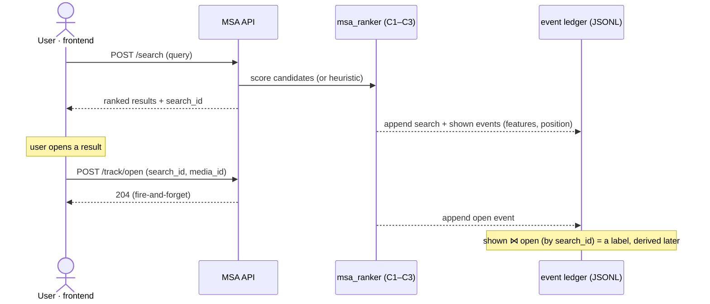
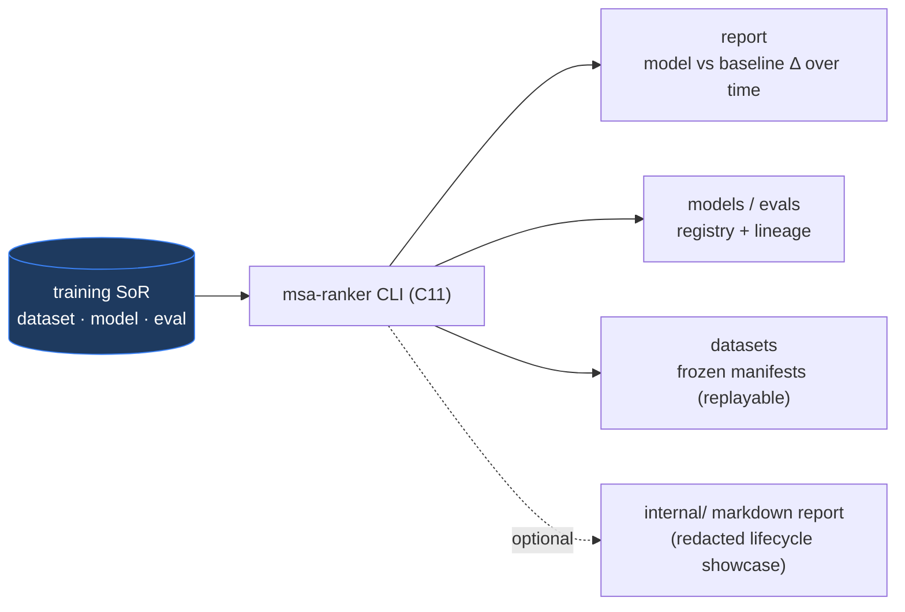

# Architecture — msa-ranker

> **Stage 4 artifact** of the development workflow
> (Architecture). Topology, components, the two data flows, the integration seam, the
> two stores, failure modes — and the load-bearing decisions, logged to the ledger.
> Driver: human owns, agent drafts. Status: **draft**; new decisions ADR-009…013 all
> **Accepted** (ratified after review).
>
> Reads on: [`requirements.md`](./requirements.md), [`research.md`](./research.md),
> [`adrs.md`](./adrs.md) + [`invariants.md`](./invariants.md). **Resolves** the
> requirements §7 open questions (mapping in §13).

## 1. The sketch (topology)

Two **independent workflows** connected by **two file artifacts** — no shared mutable
store, a **single writer** on each side:

- **MSA (online)** emits an **append-only JSONL event ledger** — its *only* output.
- **Training (offline)** **ingests** that ledger into **its own SoR**, learns, and
  emits a **model + manifest** — its *only* output, shipped back to MSA.



**Read it as:** the client round-trip **(1)(2)(3)** produces events that MSA *appends*
to the JSONL ledger (search + shown, with positions/features, then opens). Training
**ingests** a copy of that ledger into its own SoR, derives labels, trains, evals, and
**registers a model + manifest** — the two `==>` edges are the only things crossing the
boundary: **ledger out, model+manifest back.** MSA emits **events, not labels**;
turning events into labels (debiasing, ADR-007) is training-side, so MSA stays dumb and
the raw record is re-derivable.

## 2. The two workflows & their contract

| | **MSA — online** | **Training — offline** |
|---|---|---|
| Runs | wherever MSA is installed (macOS/Linux/Windows) | any CPU machine, same or different (ADR-003) |
| Writes | the **JSONL event ledger** (only) | its **own SoR** + the **model+manifest** (only) |
| Reads | the **model+manifest** (gate + serve); `media.sqlite` read-only | a **copy of the ledger** |
| Owns | the irreplaceable raw event record | datasets, model registry, eval history |

**Contract = two artifacts** crossing a path-based handoff (§11): the **event ledger**
(MSA→training) and the **model+manifest** (training→MSA). Neither side touches the
other's store; each store has exactly one writer.

## 3. Components

**MSA side** (a thin shim + the `msa_ranker` serving/ledger entrypoints):

| # | Component | Responsibility | Realizes |
|---|---|---|---|
| C1 | **Feature extractor** | candidate + query ctx → deterministic feature vector | FR-4 |
| C2 | **Serving scorer** | load model artifact; `score()`; cold-start gate; safe fallback | FR-13/14, NFR-1/3 |
| C3 | **Ledger appender** | best-effort append of `search`/`shown`/`open` events to the JSONL ledger | FR-3/16 |

**Training side** (the rest of the `msa_ranker` library, run via CLI):

| # | Component | Responsibility | Realizes |
|---|---|---|---|
| C4 | **Ledger ingester** | fold the JSONL ledger into the SoR (idempotent by event id) | FR-3 |
| C5 | **SoR + migrations** | `open_db()`, WAL, additive SQL migrations, schema | FR-18, INV-7 |
| C6 | **Label builder** | SoR events → position-bias-aware labels | FR-5 |
| C7 | **Dataset builder** | freeze/replay a training set by manifest id | FR-6 |
| C8 | **Trainer** | fit the ranker; emit artifact | FR-8/10 |
| C9 | **Eval harness** | NDCG@k / MRR on a leak-free split; measure baseline | FR-1/2, FR-7 |
| C10 | **Model registry** | record artifact, params, dataset id, eval; write the **manifest** | FR-9 |
| C11 | **Monitoring / CLI** | report model-vs-baseline; drive ingest/train/eval | FR-17 |

**Boundary (ADR-010/012):** `msa_ranker` is one importable package; MSA calls only
C1–C3; C4–C11 run on the training side. The library **never writes MSA's DB** (reads
`media.sqlite` read-only, INV-6) and MSA never touches the training SoR.

## 4. Online data flow (serve + emit ledger)

1. **Search.** `/search` runs to the rerank seam; the shim mints a **`search_id`** (ULID).
2. **Score.** Flag on **and** model ready (gate, §7) → C2 scores via C1; else heuristic
   (INV-3). Any C1/C2 error → heuristic (serving never fails on the model).
3. **Append shown.** C3 appends a `search` event and one `shown` event per returned
   result — **with `position` + feature vector** — to the JSONL ledger. **Best-effort,
   post-response** (§8): a ledger failure never touches the response.
4. **Return.** Response carries results **and `search_id`**.
5. **Open.** The frontend `POST`s `/track/open {search_id, media_id}`; C3 appends an
   `open` event. Fire-and-forget — a drop costs a label, not the user's open.



## 5. Offline data flow (ingest → learn)

1. **Ingest** (C4): fold a copy of the JSONL ledger into the SoR — **idempotent by
   `ev_id`** (re-ingest is safe; a watermark tracks consumed files/offsets).
2. **Derive labels** (C6): join `open` → `shown` per `search_id`; opened = positive;
   **Click > Skip-Above** — un-opened results *above* the deepest open = negative,
   *below* it = unlabeled (ADR-007); user-scoped + resolved-entity keyed (ADR-008).
3. **Freeze dataset** (C7): a `dataset` row records the manifest → replayable by id
   (FR-6); query-grouped split (FR-7/INV-4).
4. **Train** (C8): linear/logistic baseline first (ADR-002) → artifact.
5. **Eval** (C9): NDCG@k / MRR on the held-out split; the **baseline** (MSA heuristic on
   the same split) is measured first and stored (INV-1).
6. **Register** (C10): `model` + `eval` rows; write the **manifest** beside the
   artifact. "Ready" = an eval beats the baseline (gate, §7).

### Observability — seeing the offline plane

Every step persists a durable SoR row; the **CLI/report (C11, FR-17)** is the window.
The **training-side SoR** powers the history; MSA's side shows only the **served
model's manifest**.



`eval.model_id → model.dataset_id → dataset.manifest` chains every score to its data —
auditable and reproducible. This is **msa-ranker's own** ML-telemetry observability,
*not* devdash (which observes the engineering process pull-based; not a devdash input).
Any generated report is **aggregate/redacted** — **never raw queries or media_ids**
(ADR-014 / INV-10).

## 6. Integration with MSA (the seam)

- **Config.** One `ranker` section (`RankerConfig`) owns all four keys. Serving:
  `enable_learning_to_rank: bool = False`, `ltr_model_dir: Optional[str] = None`.
  Telemetry/privacy: **`event_logging: bool = True`** (the master privacy off-switch —
  off ⇒ *no* ledger appends; ADR-014), `ledger_dir` (spec 01). Surface all in
  `config.yaml`. The two concerns are **orthogonal** — logging works with the serving
  flag off, and vice-versa.
- **Model load.** FastAPI **lifespan startup**: if the flag is on, the shim reads the
  manifest in `ltr_model_dir`, applies the gate (§7), and loads the artifact once onto
  app state. Hot-swap on a new manifest is a later nicety; v1 picks up a new model on
  restart.
- **Seam injection.** The `for m in candidates` loop at `engine.py:542-551` branches:
  flag-on + model-ready → `serving.score(...)`; else `score_breakdown()`. Both write the
  same `m["score"]` + breakdown keys, so sort/format downstream is untouched.
- **Capture.** `/search` returns `search_id`; new `POST /track/open` appends the open
  event. Both delegate to C3.
- **Read-only features.** C1 may resolve `person_id`s from `media.sqlite` via
  `connect_readonly` — never a write handle (INV-6).

**As built (S-3.2/S-3.3 — binding):** features are computed **once at the seam** inside
`QueryEngine.search_for_serving` (where `source_scores`/`faces`/query-context exist) and
attached to each result; the shim logs that vector and serving will reuse the *same*
call, so logged == served features (no skew). `person_id` is resolved **in the same
face/people lookup** that produces names (carried together), and **filter-panel
selections are merged into the query context** alongside text-inferred intent (today the
Search tab exposes place + date — place feeds `place_match`; people live only in Browse,
so the people-merge is future-proof). The import and the per-search
feature step are both guarded — failure disables features for that search (search never
errors; no empty-feature rows). Details: [`specs/02-feature-extraction.md`](specs/02-feature-extraction.md)
"Implementation notes".

## 7. Serving policy — cold-start gate, fallback, latency

- **Cold-start gate (ADR-011).** With the flag **on**, the model serves only if a
  manifest+artifact exist **and** the manifest's `beats_baseline` is true. Else →
  heuristic. The flag is "opt-in"; the gate is "is it actually good yet." Manifest-driven
  — MSA needs no access to the training SoR.
- **Fallback (INV-3).** Flag off, no ready model, or any runtime error ⇒ the heuristic,
  byte-identical to today.
- **Latency (NFR-3).** Target **p95 added rerank ≤ 5 ms** for k ≤ 200 (tree/linear over
  a vectorized batch — typically sub-ms); model load is one-time at startup; ledger
  append is off the response path (§8).

## 8. Failure modes & degradation (ADR-013 / INV-9)

The ranker and its ledger are **off the correctness path** — MSA's search and the
user's open never break because of them.

| Case | Behaviour |
|---|---|
| **`msa_ranker` not installed** | integration import is **guarded** → no scoring, **no `/track/open`** route, MSA byte-identical to today (INV-3). An old frontend's `/track/open` → 404, ignored (open is a separate `GET`). |
| **Ledger path missing** | C3 creates it (append self-heals) — the normal first-run state, nothing dropped. |
| **Ledger unwritable** (perms, disk full, RO FS) | append **drops + logs a warning + bumps a health counter**; `/search` still returns; the open still works. |
| **Model / manifest absent or stale** | heuristic fallback (FR-14); gate stays closed. |
| **Gate passes but `Ranker.load()` fails** (corrupt artifact / race with the atomic rename) | startup load is **wrapped in try/except → `None`** ⇒ heuristic; MSA still starts (ADR-013/INV-3). Never propagates to the FastAPI lifespan. |
| **Scoring / feature error** | heuristic fallback; `search_id` still returned; **no ledger events appended** for that search (empty-feature rows avoided) — any later `/track/open` for it is an orphaned `open`, dropped at S-4 label construction. |

Mechanics: `/search`'s append runs as a **post-response background task**, guarded —
zero added latency, can't fail the request. `/track/open` returns **204 even on a
dropped append**. **Drop-and-log suffices** — the append-only **local ledger *is* the
durable buffer** (no shared write to fail mid-flight, unlike a DB), so **no spool layer
is needed**; the only residual fault is an unwritable local ledger dir, which a spool
can't help (same disk).

## 9. The feature vector (v1 sketch)

Engineered from inputs already at the seam ([research §3](./research.md)); exact list +
encodings pinned in specs (Stage 5). Candidates: `raw_similarity_score`; per-source max
score (img/vid/cap/asr); `num_sources`/`is_person_expand`; `person_hits` (resolved
`person_id` ∩ query people); `has_person_intent`; `tag_overlap`; `media_type`;
`recency`; `has_gps`/`place_match`; `query_len`.

> **`position` is *not* a serving feature** — it is logged for *label debiasing*
> (ADR-007); feeding it at serve time would teach the model to trust the current order.
> Resolve-then-rank: person features key on resolved `person_id`s (ADR-008).

## 10. The two stores + the model artifact

**(a) Event ledger — JSONL, MSA-owned, append-only.** Lives in **MSA's data area** (a
path MSA owns, config-driven, gitignored — **not** `~/.msa-ranker/`, which is the
training SoR; INV-5). One JSON object per line; `events-YYYYMMDD[-NN].jsonl[.gz]`,
default 64 MB rotation (spec 01); `ev_id` unique for idempotent ingest; `search_id`
correlates:

```json
{"ev":"search","ev_id":"…A","search_id":"…S","user_id":"default","ts":1.73e9,"query":"<query_text>","ctx":{"people":["<person_id>"],"date_intent":null,"visual_tokens":["<tok>","<tok>"]},"flag_on":true,"model_version":"m_007","k":50}
{"ev":"shown","ev_id":"…B","search_id":"…S","media_id":"abc","position":0,"score":0.81,"heuristic_score":0.77,"features":{"sim":0.74,"person_hits":1,"…":0}}
{"ev":"open","ev_id":"…C","search_id":"…S","media_id":"abc","user_id":"default","ts":1.73e9}
```

**(b) Training SoR — SQLite, training-owned** (built by ingesting the ledger; additive
`migrations/0001_initial.sql`, WAL, single `open_db()`; ADR-005 principles carry over):

```sql
CREATE TABLE IF NOT EXISTS ingest_state (   -- idempotency watermark
  ledger_file TEXT PRIMARY KEY, byte_offset INTEGER NOT NULL, updated_ts REAL NOT NULL);
CREATE TABLE IF NOT EXISTS search (
  ev_id TEXT NOT NULL UNIQUE,                 -- ledger event id; SoR idempotency anchor
  search_id TEXT PRIMARY KEY, user_id TEXT NOT NULL DEFAULT 'default',
  query_text TEXT NOT NULL, query_ctx_json TEXT, flag_on INTEGER NOT NULL,
  model_version TEXT, k INTEGER NOT NULL, created_ts REAL NOT NULL);
CREATE TABLE IF NOT EXISTS result_shown (
  ev_id TEXT NOT NULL UNIQUE,                 -- idempotency anchor
  search_id TEXT NOT NULL, media_id TEXT NOT NULL, position INTEGER NOT NULL,
  score REAL NOT NULL, heuristic_score REAL NOT NULL,  -- always logged → baseline replay (NN1)
  features_json TEXT NOT NULL,
  PRIMARY KEY (search_id, media_id));
CREATE INDEX IF NOT EXISTS idx_shown_search_pos ON result_shown(search_id, position);
CREATE TABLE IF NOT EXISTS interaction (
  ev_id TEXT NOT NULL,                        -- ULID; the PK (unique per event)
  search_id TEXT NOT NULL, media_id TEXT NOT NULL, user_id TEXT NOT NULL DEFAULT 'default',
  action TEXT NOT NULL DEFAULT 'open', dwell_ms INTEGER, created_ts REAL NOT NULL,
  PRIMARY KEY (ev_id));                       -- ev_id avoids the (…,created_ts) collision + dwell clash
CREATE INDEX IF NOT EXISTS idx_inter_search ON interaction(search_id, media_id);
CREATE TABLE IF NOT EXISTS dataset (
  dataset_id TEXT PRIMARY KEY, created_ts REAL NOT NULL, manifest_json TEXT NOT NULL, note TEXT);
CREATE TABLE IF NOT EXISTS model (
  model_id TEXT PRIMARY KEY, created_ts REAL NOT NULL, artifact_path TEXT NOT NULL,
  artifact_sha TEXT NOT NULL, algo TEXT NOT NULL, params_json TEXT,
  dataset_id TEXT NOT NULL, FOREIGN KEY (dataset_id) REFERENCES dataset(dataset_id));
CREATE TABLE IF NOT EXISTS eval (
  eval_id TEXT PRIMARY KEY, model_id TEXT, dataset_id TEXT NOT NULL,
  metric TEXT NOT NULL, k INTEGER, value REAL NOT NULL, is_baseline INTEGER NOT NULL DEFAULT 0,
  created_ts REAL NOT NULL, FOREIGN KEY (model_id) REFERENCES model(model_id));
```

**(c) Model + manifest — training output, shipped to MSA.** The artifact plus a small
sidecar JSON the serving gate reads (no SoR access needed at serve time):

```json
{"model_id":"m_007","algo":"logreg","params":{"C":1.0},"dataset_id":"d_003",
 "feature_set_version":"v1","trained_ts":1.73e9,"artifact_sha":"…",
 "eval":{"ndcg@10":0.72,"mrr":0.66},"baseline":{"ndcg@10":0.45},"beats_baseline":true}
```

## 11. Handoff & deployment

MSA serves **wherever it is installed** (macOS, Linux, or Windows), and training runs
on **any CPU machine**, the same one or a different one (ADR-003). Because training is
**manually triggered** (ADR-011) there is **no live coupling** between the planes: you
run the CLI wherever a copy of the ledger and the model dir are reachable, so *same
machine or different host doesn't change the design.* The handoff is **two paths**, not
a service:

- **Ledger out:** training reads a **copy/snapshot** of the append-only ledger (append-
  only ⇒ a snapshot is always consistent; ingest is idempotent so overlap is harmless).
- **Model back:** training writes the artifact+manifest with **write-temp-then-rename**
  (atomic) so MSA never reads a half-written model.

The location is **any directory both planes can reach**: a local dir when they share a
machine, or a shared/synced folder when they do not. It is path-based and pluggable;
**no network service** on the serving path. A sync/copy tool is an implementation
detail behind those two paths.

> **Reference deployment.** The loop was built and is validated against one concrete
> setup: MSA serving in a Linux VM on a Windows host, training on the host or in the
> VM, with a VM↔host shared folder as the handoff location. That setup motivated the
> shared-folder handoff (ADR-012), but nothing in the design depends on it; MSA itself
> ships for macOS, Linux, and Windows.

## 12. Repo / module layout

```text
msa-ranker/
  docs/   pyproject.toml   .github/workflows/{ci,claude-pr-review}.yml
  src/msa_ranker/
    __init__.py  config.py  ids.py
    migrations/0001_initial.sql            # packaged (importable wheel) — INV-7
    ledger.py     serving.py   features.py     # MSA-side: C3, C2, C1
    db.py  ingest.py  labels.py  datasets.py    # training: C5, C4, C6, C7
    train.py  eval.py  registry.py  cli.py       # training: C8, C9, C10, C11
  tests/   CLAUDE.md   AGENTS.md
```

*(Migrations live **inside** the package (`src/msa_ranker/migrations/`) so they ship with
the wheel and `db.open_db()` finds them in any install — editable or pinned.)*

One importable package; MSA imports `ledger`/`serving`/`features`, the CLI drives the
rest. MSA-side glue (flag, seam branch, `search_id`, `/track/open`) lives in the **MSA
repo**.

## 13. Open questions resolved (requirements §7 → here)

| §7 item | Resolution |
|---|---|
| Opens-capture mechanism | `search_id` + `POST /track/open`, appended to the ledger (ADR-009, §4) |
| User identity capture | `user_id` on events, default `'default'` (ADR-008, §10) |
| Feature set & encoding | v1 sketch §9; exact list → specs |
| Cold-start behaviour | manifest-driven serving gate §7 (ADR-011) |
| Latency budget | p95 ≤ 5 ms added, k ≤ 200 (NFR-3, §7) |
| Retrain trigger | manual CLI for v1 (ADR-011); data/drift later |
| Store schema | §10 (JSONL ledger + training SoR DDL + manifest) |

## 14. New decisions

- **ADR-009** — open-signal capture via `search_id` + `/track/open` (Accepted).
- **ADR-010** — `msa_ranker` importable library + thin in-process shim (Accepted).
- **ADR-011** — serving cold-start gate + manual retrain v1 (Accepted).
- **ADR-012** — decouple: JSONL event ledger (MSA) + training-owned SoR + model handoff
  (supersedes ADR-005's single-SoR shape).
- **ADR-013** — ledger/telemetry is best-effort / fail-open (establishes INV-9).

## 15. How invariants are enforced

| Invariant | Mechanism / test point |
|---|---|
| INV-2 (deterministic plumbing) | C1 features + C2 routing golden-tested |
| INV-3 (flag off ≡ today) | golden: flag-off order == heuristic order, byte-identical |
| INV-4 (no leakage) | C7 query-grouped split; manifest replay test |
| INV-6 (reorder-only, no MSA write) | C2 output is a permutation of input; no write handle to `media.sqlite` |
| INV-7 (additive migrations) | C5 runner applies only un-recorded files; CI diff-guard |
| INV-5 (private stores) | ledger + SoR paths outside repo; publishability check |
| INV-9 (telemetry isolation) | unwritable-ledger fault → `/search` returns full set, order byte-identical; `/track/open` → 204 |
