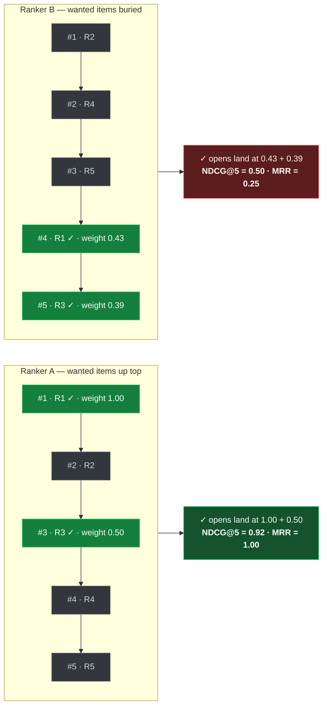

# Research notes — msa-ranker (learned ranking for media-search-agent)

> **Stage 2 artifact** of the development workflow
> (Research & prototype). De-risks feasibility, educates on the space, records the
> approach **chosen** and the rest **deferred**. A *living* doc — revised as later
> stages bite. Status: **draft**.
>
> Decisions reached here are recorded in the decision ledger:
> [`adrs.md`](./adrs.md) (ADR-001…014) and [`invariants.md`](./invariants.md)
> (INV-1…INV-10). Read those for the binding form; this doc carries the *why*.

## 1. What this stage de-risked

The seed ([`idea.md`](idea.md)) named several unknowns that "must not be
guessed." All were resolved by reading the MSA codebase and the devdash storage
precedent rather than guessing:

| Unknown (from idea) | Finding | Confidence |
|---|---|---|
| MSA stack | Python 3.11+, FastAPI + Pydantic, **SQLite** (`index/media.sqlite`) + **embedded Qdrant** (single-process file lock), CLIP / facenet / RT-DETR on PyTorch | High — read from source |
| Where the ranker attaches | An existing rerank seam: `engine.py:542-551` loops candidates → calls `score_breakdown()` (`rerankers.py:38-70`) → sorts → top-K. A learned scorer is the same shape (features → score) and drops in here | High |
| What a result looks like (feature source) | Rich per-result fields already present at rerank time — see §3 | High |
| Interaction logging | **Does not exist.** No click/open endpoint or telemetry. Label collection must be built — this is the critical-path dependency, not the model | High |
| Product-data storage precedent | devdash uses a dedicated **external SQLite system-of-record** (`~/.devdash/devdash.sqlite`), WAL, additive SQL migrations, private/gitignored, redacted overlays under `internal/` | High — read from devdash `docs/data-model.md` |
| devdash registration | `msa-ranker` already lives under devdash's `git_roots: ~/Projects/source/repos` → **auto-observed, nothing to do** | High |
| Compute | **CPU-only** for the v1→LambdaMART path — trains on *any* platform; a GPU is an *optional* accelerator for the deferred neural tier only. Serving is a small CPU artifact on the MSA host | Confirmed (ADR-003) |

**Feasibility verdict:** green. The integration seam exists, the feature inputs
exist, and the storage pattern is proven next door. The genuine risk is **labels**
(implicit, biased, and not yet collected), not modelling.

## 2. The learning-to-rank space (the education, condensed)

A ranker is a function `f(features) → score`; results are sorted by it. The three
training formulations differ in *what the model is trained to get right*:

| Family | What it learns | Loss computed over | Strength | Weakness |
|---|---|---|---|---|
| **Pointwise** | An absolute relevance / open-probability per result, independently | One result at a time | Simplest — plain regression/classification; easy to reason about & debug | Doesn't model "A should beat B"; calibration noise hurts ordering |
| **Pairwise** | Which of two results ranks higher | Pairs within a query | Directly optimizes *relative* order; robust to score scale | A swap at rank 1 costs the same as one at rank 50 |
| **Listwise** | The whole ordering / the ranking metric itself | The full result list per query | Best quality when data allows; aligns training with NDCG/MRR | Most data-hungry; easiest to overfit on tiny data |

**LambdaMART** = gradient-boosted trees trained with LambdaRank gradients, which
weight each pair's gradient by *how much swapping it changes NDCG* — making a
pairwise model behave listwise and pushing hardest on top-rank mistakes. It is the
standard serious choice for feature-vector ranking (LightGBM `objective:
lambdarank`): CPU-trained, tiny to serve, mixed numeric/categorical features, no
feature scaling. It is the **eventual** first-class model.

**Why not start there — two cold-start realities for a single-user library:**

1. **Labels are implicit and position-biased.** We observe only *opens*. An open
   is a noisy positive; a non-open is *not* a clean negative. Results shown higher
   get opened more *regardless of relevance* — so a naive model just re-learns the
   current ordering. Handling this (log the **position**; **Click > Skip-Above** —
   un-opened results *above* the deepest open are negatives, *below* it is unlabeled;
   consider inverse-propensity weighting later) is core design, and must be proven
   before a sophisticated model sits on top.
2. **Tiny data.** Early on: tens–low-hundreds of labelled searches. LambdaMART
   overfits that; a 3–8 feature regularized model generalizes better and is honest
   about the signal available.

**Metric.** For a personal library where the user opens one/few items, **NDCG@k**
is primary (graded, position-discounted — and what LambdaMART optimizes directly,
keeping **eval** — *evaluation*, the graded measurement of model quality, distinct
from a pass/fail test ([§8](#ranking--evaluation)) — and the training objective
aligned) with **MRR** secondary. The harness
and a **measured baseline on MSA's current ordering** come *before* any model.

**How the metric works — a worked MSA example.** Search *"golden retriever on the
beach"*; MSA returns 5 candidates and the logs later show you opened two — the dog
on the sand (`R1`) and a video keyframe in the water (`R3`). Those opens *are* the
relevance labels (no rating prompt — FR-3). Two rankers order the **same** 5
candidates:

| | pos 1 | pos 2 | pos 3 | pos 4 | pos 5 |
|---|---|---|---|---|---|
| **Ranker A** | **R1 ✓** | R2 | **R3 ✓** | R4 | R5 |
| **Ranker B** | R2 | R4 | R5 | **R1 ✓** | **R3 ✓** |

(✓ = opened.) Scoring each ordering against the opens:

```text
Ranker A:  NDCG@5 = 0.92    MRR = 1.00   (first open at position 1)
Ranker B:  NDCG@5 = 0.50    MRR = 0.25   (first open at position 4)
```

Same 5 results, two orderings — each position carries a weight `1/log2(pos+1)`, and
the metric rewards putting the ✓ opens where the weight is high:



The two green ✓ nodes are the *same opened results* in both columns — A parks them
on the heavy top weights, B on the light bottom ones, and the score falls straight
out of where they sit. `0.92 > 0.50` mechanically says "A's ordering is better" — one comparable number per
ordering, averaged across all searches, is how any two rankers (or a model vs the
baseline) get compared. The two lenses **agree on the winner but reward
differently**: MRR collapses 1.00→0.25 on the *first* hit's position alone (it
ignores the second open); NDCG eases 0.92→0.50 because it credits *both* opens,
weighted by height — which is why NDCG leads and MRR rides along as the legible
check. (Construction: NDCG@k = DCG ÷ ideal-DCG, where each opened result contributes
`1/log2(position+1)`; MRR = 1/rank-of-first-open.)

**Analogy.** A streaming home row: you search, it lines up thumbnails, you press
play on one. A good ranking put it first; a bad one made you scroll. Nobody rated
the row — the metric just watches *which thumbnail you pressed play on* and how near
the front it was. MRR = "scroll distance to the first play"; NDCG = "how near the
front were *all* my plays, top spots counting most." The press-play (or the MSA
**open**) is the implicit label — observed behaviour, not a survey — the whole
reason the ranker can learn from you without interrupting to ask.

**GPU's role.** It raises the *ceiling*, not the *start*: once real data
accumulates, a small MLP or — more interestingly for media — a **cross-encoder**
that jointly attends to the query and each result's CLIP/caption/tag features
becomes a genuine quality lever. An *upgrade*, earned after the loop works.

## 3. Per-result feature inputs already available (drives feature design)

At the rerank seam, each candidate already carries enough to build a real LTR
feature vector **without touching MSA's retrieval** (the query side gives free text
→ CLIP embedding + decomposed people + date intent):

| Field | Type | Source | Candidate LTR use |
|---|---|---|---|
| `raw_similarity_score` | float [0–1] | Qdrant cosine | Dense base signal — the current ranking's backbone |
| `source` / `source_scores` | enum / dict | retriever merge | Which collection(s) matched (img/vid/cap/asr/person_expand) + per-source strength → multi-evidence features |
| `tags` / `scene_tags` | list[str] | detection | Query-token ↔ tag overlap; category priors |
| `faces` vs `inferred_people` | list[str] | SQLite / query | `person_hits` = intersection count → person-intent match |
| `place` | str | SQLite/Qdrant | Location match vs query place intent |
| `gps_lat` / `gps_lon` | float | EXIF | Geospatial features |
| `date` / `timestamp` | ISO str / float | SQLite/Qdrant | Recency; date-intent match; (video) keyframe position |
| `type` | "video" \| None | Qdrant | Media-type prior (do opens skew image vs video?) |
| `shot_id` | int | Qdrant | Video shot grouping / dedup signal |

These are *inputs*; the exact engineered feature set + its contract is an
architecture/spec concern (Stage 4–5), not fixed here.

## 4. Where the product data lives (the storage space)

The ranker owns two **intertwined** data classes — and the key insight is that
they're the *same substrate viewed at two times*:

1. **ML lifecycle data** — interaction-log **labels** (query, the result set shown
   with features and positions, which result was opened), **dataset versions** (a
   frozen, replayable training snapshot), and **eval scores per model version**.
2. **Serving telemetry** — every production rerank: append-heavy, irreplaceable,
   private; doubles as the **monitoring** substrate *and* the **next round of
   training labels**. The label log and the telemetry log are the same events.

**What this store is *not* (three traps to avoid):**

- **Not `internal/metrics/`** — that's the *process-metrics* standard (milestones,
  sprints, bug/decision ledgers): how the *engineering* is going, not product data.
- **Not MSA's `index/media.sqlite`** — co-locating couples the ranker's lifecycle
  to MSA's index and fights its single-process Qdrant/SQLite file lock.
- **Not devdash** — that's a separate product that *observes* this repo pull-based;
  it's not a place we write product telemetry to.

**The precedent we mirror (devdash's `docs/data-model.md`):** a **dedicated SQLite
system-of-record outside the repo** (`~/.msa-ranker/msa-ranker.sqlite`), WAL mode,
opened via a single `open_db()` helper, with **plain versioned SQL migrations**
(`migrations/0001_*.sql`, tracked in `_migrations`, additive-only). The SoR is
gitignored / outside the repo so append-heavy private telemetry can't leak when MSA
goes public; only **redacted/aggregate** artifacts (eval scorecards, dataset
*manifests*) and human overlays (under `internal/`) are committed.

**First-cut schema sketch** (inputs to architecture, not the final DDL — Stage 4
pins tables/columns/indexes):

| Table | Shape | Holds |
|---|---|---|
| `search` | append | **user/profile id**, query text, decomposed query context, flag state, model version, ts |
| `result_shown` | append | one row per shown result: `search_id`, `media_id`, **`position`**, feature vector, score |
| `interaction` | append | the label: `search_id`, `media_id` opened, action/dwell, ts |
| `dataset` | versioned | a frozen training-set **manifest** (which searches/labels/filters) → replayable |
| `model` | versioned | artifact ref/hash, hyperparams, **training dataset id** |
| `eval` | append | `model_id`, metric (NDCG@k / MRR), value, eval-dataset id |

`position` on `result_shown` is what enables position-bias-aware labelling
([ADR-007](./adrs.md#adr-007)); the same `search`/`result_shown`/`interaction`
rows are *both* live telemetry *and* training labels — one source of truth.
**Reproducibility** comes from `dataset` manifests (replay by id), **not DVC**
([ADR-006](./adrs.md#adr-006)); retention keeps everything (small, irreplaceable)
with file-backup snapshots like devdash. A nullable **`user/profile id`** on these
rows keeps multi-user a future upgrade without re-collecting data
([ADR-008](./adrs.md#adr-008)).

## 5. Decisions reached (chosen; rest deferred)

| # | Decision | ADR |
|---|---|---|
| Attach | **In-process**, swap `score_breakdown()` behind a `config.yaml` flag, heuristic as deterministic fallback | [ADR-001](./adrs.md#adr-001) |
| Model | **Trivial pointwise baseline → LightGBM LambdaMART → neural cross-encoder (deferred)**; first loop ships the trivial baseline | [ADR-002](./adrs.md#adr-002) |
| Compute | **Train offline on CPU (any platform — no GPU for v1/LambdaMART); serve the small portable artifact in-process** on the MSA host; GPU optional for the deferred neural tier | [ADR-003](./adrs.md#adr-003) |
| Metric | **NDCG@k primary, MRR secondary; baseline measured before any model** | [ADR-004](./adrs.md#adr-004) |
| Storage | **Dedicated external SQLite system-of-record** (`~/.msa-ranker/`), additive SQL migrations, WAL, private/gitignored; redacted overlays under `internal/` | [ADR-005](./adrs.md#adr-005) |
| Reproducibility | **Dataset-manifest snapshots in the SoR, not DVC** (deferred) | [ADR-006](./adrs.md#adr-006) |
| Labels | **Store result position; position-bias-aware implicit feedback** (Click > Skip-Above: un-opened results *above* the deepest open are negatives; below is unlabeled) | [ADR-007](./adrs.md#adr-007) |

**Deferred (explicitly out of the first loop):** LambdaMART tuning, the neural
cross-encoder, inverse-propensity weighting, DVC, a sidecar serving path, multi-user
concerns. Each is an upgrade with a pinned path, not a gap.

## 6. The smallest complete loop (target of the first milestone)

1. Graded eval harness (NDCG@k / MRR) + **measured baseline** on current ordering.
2. Interaction logging (query, result set shown **with features and positions**,
   opened result = label) → the external SoR; versioned/replayable.
3. A deliberately simple baseline ranker, trained on logged interactions,
   eval-scored, that **beats the baseline**.
4. Served in-process behind the flag, with deterministic fallback.
5. Serving behaviour recorded to the SoR → also the next round of training labels.

## 7. Open risks carried into requirements/architecture

- **Cold-start labels.** Until interactions accrue, the model has little to learn
  from. Mitigation: ship logging first; the trivial model may tie the baseline
  early — that's acceptable, the loop is the deliverable.
- **Position bias** could let a model trivially re-derive the current order.
  Mitigation: ADR-007 (store position; bias-aware negatives).
- **MSA path integrity.** The ranker must only *reorder* MSA's existing candidate
  set and never alter retrieval/recall or write to MSA's index DB
  ([INV-6](./invariants.md)).
- **Train/eval leakage** on a small per-user dataset (e.g. same query across
  splits). Mitigation: query-grouped splitting ([INV-4](./invariants.md)).

## 8. Terms & definitions (glossary)

Canonical definitions for the vocabulary used across this repo's docs — grounded in
*this* project, with sources in [Further reading](#further-reading) (`[n]`). Other
docs link here rather than redefining terms.

### Ranking & evaluation

- **Learning-to-Rank (LTR)** `[3]` — supervised learning of a function
  `f(features) → score` used to **order** a result set, trained on data where the
  preferred order is known. Non-LLM and supervised here.
- **Candidate set** — the result set MSA's retrieval already produces for a query;
  the ranker only **reorders** this set, never adds/removes (INV-6).
- **Reranking** — reordering an existing candidate set with a richer scorer than the
  one that retrieved it. msa-ranker is a reranker, not a retriever.
- **Relevance label** — the signal of how relevant a result was to a query. Here it
  is **implicit** (an *open*), **binary** to start (opened = 1) and optionally
  **graded** later (open + long dwell = 2). Contrast editorial/human-judged labels,
  which this project does not have.
- **NDCG@k — Normalized Discounted Cumulative Gain** `[1]` — the **primary** metric.
  Sum each result's relevance *gain*, discounted by position (`1/log2(pos+1)`), over
  the top `k`; divide by the best-possible (ideal) such sum to land in `[0,1]`.
  Rewards putting relevant results high; supports graded relevance. See the worked
  example in [§2](#2-the-learning-to-rank-space-the-education-condensed).
- **DCG / IDCG** `[1]` — **D**iscounted **C**umulative **G**ain is the un-normalized
  position-discounted sum; **I**DCG is the DCG of the ideal ordering. `NDCG = DCG /
  IDCG`.
- **MRR — Mean Reciprocal Rank** `[2]` — the **secondary** metric. Per query, the
  reciprocal of the rank of the **first** relevant result (`rank 1 → 1.0`,
  `rank 3 → 0.33`); averaged over queries. Ignores all but the first hit — legible,
  but uses less signal than NDCG.
- **MAP — Mean Average Precision** `[3]` — an alternative graded-ranking metric
  (mean of per-query average precision). Noted for context; **not** used here (NDCG
  fits graded relevance and aligns with the training objective).
- **Baseline / baseline heuristic** — MSA's **current** ordering
  (`cosine_similarity × person_multiplier × expansion_multiplier`, in
  `rerankers.py:score_breakdown`). It is **measured on the eval harness before any
  model is trained** (INV-1, [ADR-004](./adrs.md#adr-004)); every model's quality is
  reported as a **Δ versus this baseline**, never as an absolute.
- **Eval (graded) vs test (pass/fail)** `[testing standard]` — model *quality* is
  measured by **graded eval** (NDCG/MRR, opt-in, never in CI); the deterministic
  plumbing around it is verified by **pass/fail golden tests** (INV-2). The two are
  not interchangeable.
- **Held-out set / query-grouped split** — data reserved for eval, never trained on.
  Splitting is **query-grouped** so the same query can't appear in both train and
  eval (no leakage — INV-4, FR-7).

**Test vs eval at a glance** — why model *quality* is graded, never asserted as
pass/fail (INV-2):

| | **Test** (pass/fail) | **Eval** (graded) |
|---|---|---|
| Question it answers | "Is the code *correct*?" | "Is the model *good*?" |
| Output | green / red (binary) | a score, e.g. NDCG@10 = 0.72 |
| Anchored to | golden answers — exact expected output | a metric over held-out data |
| Determinism | deterministic — same input, same result | graded — quality is a number on a spectrum |
| Runs in CI? | yes, on every change | **no** — opt-in, local-only |
| Example here | flag off ⇒ ordering byte-identical to today → *must pass* | does the ranker beat the baseline on NDCG? → *measured* |

The deterministic *plumbing* around the model (feature extraction, the flag, the
fallback, the telemetry write) gets **tests**; the model's *ranking quality* gets
**eval**. Eval is non-deterministic and graded, so it is kept **out of CI**
(testing standard).

### Learning-to-rank models

- **Pointwise / Pairwise / Listwise** `[3]` — the three LTR formulations (predict an
  absolute per-item score / predict which of two items ranks higher / optimize the
  whole list or the metric directly). Compared in
  [§2](#2-the-learning-to-rank-space-the-education-condensed).
- **LambdaRank / LambdaMART** `[4]` — LambdaRank weights each training pair's
  gradient by *how much swapping it would change NDCG*, making a pairwise learner
  behave listwise; **LambdaMART** is LambdaRank gradients applied to gradient-boosted
  trees. The pinned upgrade model ([ADR-002](./adrs.md#adr-002)).
- **GBDT — Gradient-Boosted Decision Trees** `[6]` — an ensemble of shallow trees
  fit stage-wise to the gradient of the loss. The model family LambdaMART belongs to.
- **LightGBM** `[5]` — a fast, widely-used GBDT library; its `objective: lambdarank`
  is the concrete LambdaMART implementation this project would use.
- **Cross-encoder (neural reranker)** `[9]` — a neural model that scores a
  (query, result) pair by **jointly** attending to both, rather than comparing
  precomputed embeddings. The deferred GPU-enabled upgrade ([ADR-002](./adrs.md#adr-002)).
- **Feature vector / feature extraction** — the deterministic transform from an MSA
  candidate + query context to the numeric inputs the model scores (FR-4); the
  available raw inputs are catalogued in [§3](#3-per-result-feature-inputs-already-available-drives-feature-design).

### Data, labels & training

- **Implicit feedback** `[8]` — relevance inferred from *behaviour* (opens/clicks)
  rather than explicit ratings. Free and abundant, but **biased** (below).
- **Position bias** `[7]` — results shown **higher** get opened more *regardless of
  relevance*. Untreated, a model just re-learns the current order. Mitigated by
  logging each result's **position** and bias-aware labelling via **Click >
  Skip-Above** ([ADR-007](./adrs.md#adr-007)).
- **Click > Skip-Above** `[7]` — the labelling heuristic (Joachims): an opened result
  is a positive; an un-opened result ranked **above** the deepest open was
  examined-but-passed → negative; results **below** the deepest open are likely
  unexamined → unlabeled. Bias-aware because it only trusts comparisons where
  examination is implied.
- **Inverse Propensity Weighting (IPW)** `[7]` — a debiasing technique that weights
  each observed click by the inverse of its estimated examination probability. A
  **deferred** upgrade beyond the first loop.
- **Cold start** — the early-life condition of little or no training data (acute for
  a single-user library). Drives "start trivial" ([ADR-002](./adrs.md#adr-002)) and a
  cold-start serving policy (requirements §7).
- **Dataset manifest** — a frozen, id-addressable description of which
  searches/labels/filters compose a training set, making a run **replayable** without
  DVC ([ADR-006](./adrs.md#adr-006), FR-6).
- **DVC — Data Version Control** `[14]` — an open-source tool that brings git-style
  versioning to large **datasets and model files**: the big artifact is stored in a
  cache/remote while a small hash **pointer** is committed to git, keeping code,
  data, and models reproducibly in lockstep. **Not adopted** here — small single-user
  data already in the SoR makes dataset manifests (above) sufficient
  ([ADR-006](./adrs.md#adr-006)); a deferred option if datasets ever grow large.
- **Pooled model / user-aware logging** — v1 trains *one* model over all household
  users' interactions (**pooled**) while logging a per-user/profile id, so per-user or
  user-as-feature personalization stays a future option without re-collecting data
  ([ADR-008](./adrs.md#adr-008)).

### Serving & storage

- **Rerank seam** — the integration point in MSA (`engine.py:542-551` →
  `score_breakdown()`) where ordering is computed; the learned scorer swaps in here
  behind a flag ([ADR-001](./adrs.md#adr-001)).
- **In-process vs sidecar** — serving the model inside MSA's process vs as a separate
  network service. This project is **in-process** ([ADR-001](./adrs.md#adr-001)).
- **Flag / deterministic fallback** — a `config.yaml` toggle; **off** ⇒ MSA's
  heuristic ordering runs byte-identically (INV-3), and any model error fails *safe*
  to the heuristic (FR-14).
- **System-of-Record (SoR)** — the authoritative, irreplaceable data store: a
  dedicated **SQLite** database **outside the repo** (`~/.msa-ranker/`) holding
  labels, datasets, models, eval scores, and serving telemetry
  ([ADR-005](./adrs.md#adr-005)).
- **WAL — Write-Ahead Logging** `[12]` — a SQLite journaling mode allowing concurrent
  reads during writes; used by the SoR.
- **Additive migration** — a forward-only, numbered SQL schema change
  (`migrations/000N_*.sql`); a **shipped migration is never edited or dropped**
  (INV-7).

### Retrieval substrate (MSA)

- **Embedding / CLIP** `[10]` — CLIP maps images and text into a shared vector space;
  MSA encodes the query and media into these vectors. The cosine of query↔result
  vectors is the base ranking signal (`raw_similarity_score`).
- **Cosine similarity** — the angle-based closeness of two embedding vectors, in
  `[-1,1]` (≈`[0,1]` for CLIP); MSA's primary relevance signal today.
- **ANN — Approximate Nearest Neighbour / Qdrant** `[11][13]` — sub-linear nearest-
  vector search (e.g. HNSW graphs); **Qdrant** is the embedded vector DB MSA uses to
  retrieve the candidate set the ranker then reorders.

### Further reading

1. Järvelin & Kekäläinen (2002), *Cumulated Gain-based Evaluation of IR Techniques*,
   ACM TOIS 20(4). Overview: <https://en.wikipedia.org/wiki/Discounted_cumulative_gain>
2. *Mean Reciprocal Rank* — <https://en.wikipedia.org/wiki/Mean_reciprocal_rank>
3. Liu (2009), *Learning to Rank for Information Retrieval*, Foundations and Trends in
   IR 3(3). Overview: <https://en.wikipedia.org/wiki/Learning_to_rank>
4. Burges (2010), *From RankNet to LambdaRank to LambdaMART: An Overview*, Microsoft
   Research Tech. Report MSR-TR-2010-82.
5. Ke et al. (2017), *LightGBM: A Highly Efficient Gradient Boosting Decision Tree*,
   NeurIPS. Docs: <https://lightgbm.readthedocs.io>
6. Friedman (2001), *Greedy Function Approximation: A Gradient Boosting Machine*,
   Annals of Statistics 29(5).
7. Joachims, Swaminathan & Schnabel (2017), *Unbiased Learning-to-Rank with Biased
   Feedback*, WSDM. (Position bias, IPW.)
8. Joachims et al. (2005), *Accurately Interpreting Clickthrough Data as Implicit
   Feedback*, SIGIR.
9. Nogueira & Cho (2019), *Passage Re-ranking with BERT*, arXiv:1901.04085.
   (Cross-encoder reranking.)
10. Radford et al. (2021), *Learning Transferable Visual Models From Natural Language
    Supervision* (CLIP), arXiv:2103.00020.
11. Qdrant documentation — <https://qdrant.tech/documentation/>
12. SQLite, *Write-Ahead Logging* — <https://sqlite.org/wal.html>
13. Malkov & Yashunin (2018), *Efficient and Robust Approximate Nearest Neighbor
    Search Using Hierarchical Navigable Small World Graphs*, IEEE TPAMI.
14. DVC — *Data Version Control* — <https://dvc.org>

## 9. Provenance

Findings grounded in: MSA `src/msa_query/query_engine/{engine,rerankers}.py`,
`src/msa_apps/search_api/schemas.py`, `config.yaml`; devdash `docs/data-model.md`,
`src/devdash/db.py`. Standards: development-workflow,
testing, agent-instructions,
planning-vocabulary.
