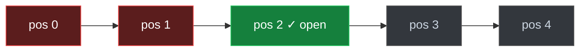

# Spec 03 — Label construction  *(crux)*

> Realizes **FR-5 / FR-7**, implements **ADR-007** (Click > Skip-Above), enforces
> **INV-4** (leak-free). The transform from ingested events → training rows. Status: draft.

## Purpose

Turn raw open/shown events into **position-bias-aware** training labels — the single
place the debiasing logic lives (MSA emits events, not labels — ADR-012). Get this
wrong and the model re-learns position instead of relevance.

## Interface

```python
# msa_ranker/labels.py  (C6)
@dataclass(frozen=True)
class LabelRow:
    search_id: str; user_id: str; media_id: str
    features: list[float]; label: int; group: str        # group = split key

def build_labels(searches: Iterable[SearchBundle]) -> list[LabelRow]:
    """Click > Skip-Above (ADR-007). One SearchBundle = a search + its shown + opens."""

def split(rows: list[LabelRow], *, seed: int, eval_frac: float
          ) -> tuple[list[LabelRow], list[LabelRow]]:
    """Query-GROUPED split — a `group` lands wholly in train or eval (INV-4)."""
```

## Algorithm — Click > Skip-Above (ADR-007)

For each `search_id` (scoped to its `user_id`):

1. Load `result_shown` rows; `opened` = media with an `open` interaction.
2. **If `opened` empty → drop the search** (no preference signal).
3. `deepest = max(position of opened rows)`.
4. Per shown row `r`: `r ∈ opened` → **1**; elif `r.position < deepest` → **0**
   (skip-above); else (`> deepest`, not opened) → **drop** (unlabeled).



*Open at position 2 → positives `{2}`, negatives `{0,1}` (above = examined-but-passed),
dropped `{3,4}` (below = likely unexamined). **Not** the reverse.*

### Rules & edge cases

- **Multiple opens:** every open is positive; `deepest` = max open position; non-opens
  above it negative; below it dropped.
- **Open with no matching `shown`:** anomaly → drop + log (don't fabricate).
- **Graded labels** (dwell → grade) deferred; v1 binary.

## Group key — exact (the split key)

`group` must be defined precisely or the INV-4 test is non-deterministic: using
`search_id` (unique) **passes AC-03.6 yet still leaks** two instances of the same query
across splits (the exact gap review flagged). So `group` is a **canonical, user-scoped,
entity-based query signature** — *not* raw query text (ADR-008 resolve-then-rank):

```text
group = json.dumps([user_id, sorted(person_ids), norm_visual_tokens, canon_date], separators=(",", ":"))
```

Encoded as a **JSON array**, not a delimiter-joined string: a `user_id`/`person_id`
containing a separator char could otherwise collapse two distinct intents into one group
(a silent INV-4 violation). `canon_date` is `None` for no-date-intent, distinct from a
falsy-but-present value.

`norm_visual_tokens` = the same normalization features use (lowercased, de-duplicated,
sorted — features.py does not strip stopwords, so the group key must not either, or the
two sides would skew). Two **separate** searches with the same intent → the **same `group`**
→ the same split side; two users' "my dad" → **different** groups (user-scoped).
`build_labels` computes `group` from each search's `ctx`.

## Usage

Training (spec 05) calls `build_labels` over the ingested SoR, then `split` (query-
grouped) to get leak-free train/eval sets fed to the trainer + eval harness (spec 04).

## Ownership

- **Implements:** agent — `msa_ranker.labels` (C6).
- **Reviews / owns:** **human owns the golden label sets** (independent truth) — this is
  the crux of the ADR-007 correctness; review carefully.

## Acceptance criteria

- **AC-03.1** The diagram example → positives `{2}`, negatives `{0,1}`, dropped `{3,4}`
  (golden) — **the standing regression for the ADR-007 fix.**
- **AC-03.2** Multiple opens: deepest-open logic labels correctly (golden).
- **AC-03.3** A search with no opens contributes **zero** rows.
- **AC-03.4** Below-deepest-open non-opens are **dropped**, never labeled 0.
- **AC-03.5** Determinism: same SoR state → identical label rows.
- **AC-03.6** Split leak-freeness: no `group` spans train and eval (INV-4).
- **AC-03.7** Orphan open (no shown row) → dropped + logged, not a crash.
- **AC-03.8** Group canonicalization: two **distinct** searches with the same
  user + resolved people + normalized tokens get the **same `group`** (and land in the
  same split); differing `user_id` → different group. *(Guards against `search_id`-as-key
  leakage.)*

## Tests

| Test | Type | Case → asserts | AC | Owner |
|---|---|---|---|---|
| skip-above golden | unit/golden | open@2 of 5 → pos{2} neg{0,1} drop{3,4} | 03.1 | human |
| multiple opens | unit/golden | opens@{1,3} → deepest=3, neg above, drop below | 03.2 | human |
| no-open search | unit | zero opens → zero rows | 03.3 | agent |
| below dropped | unit | non-opens below deepest never become 0 | 03.4 | human |
| determinism | unit | repeat → identical rows | 03.5 | agent |
| leak-free split | contract | no `group` in both splits (INV-4) | 03.6 | human |
| orphan open | unit | open with no shown → dropped + logged | 03.7 | agent |
| group canonical | unit/golden | same intent, two searches → same group; diff user → diff group | 03.8 | human |

**Fixtures:** hand-constructed `SearchBundle`s with **hand-computed golden labels**
(independent truth); a multi-search set for the grouped-split leak test.
