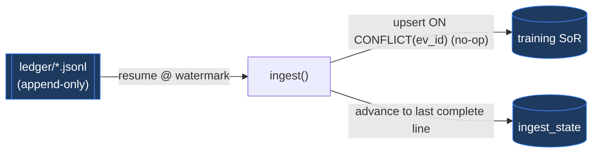

# Spec 07 — Ledger ingest → SoR

> Realizes **FR-18**, **ADR-012** (training ingests the ledger), enforces **INV-7**
> (additive migrations). The idempotent fold from JSONL ledger into the training SoR.
> Status: draft.

## Purpose

Define how the training side turns the append-only JSONL ledger (spec 01) into the
structured SoR (architecture §10) — **idempotently**, so re-ingest is always safe.

## Interface

```python
# msa_ranker/db.py / ingest.py
def open_db(path: Path) -> sqlite3.Connection:
    """The SOLE connection path: WAL + applies additive migrations (INV-7)."""

@dataclass
class IngestStats: files: int; lines: int; inserted: int; skipped: int

def ingest(sor: sqlite3.Connection, ledger_dir: Path) -> IngestStats:
    """Fold all ledger files into search/result_shown/interaction. Idempotent —
       resumes from the ingest_state watermark; ON CONFLICT(ev_id) makes re-ingest a no-op."""
```

## Contract

- **Input:** the ledger files (a copy/shared-folder snapshot — architecture §11).
- **Output:** rows in `search` / `result_shown` / `interaction` + advanced
  `ingest_state` watermark.
- Open via the single `open_db()` (WAL + additive migrations, INV-7).
- **Per file:** resume from `ingest_state(file → byte_offset)`; read new lines; per
  parsed event **upsert anchored on the unique `ev_id`** (`INSERT … ON CONFLICT(ev_id)
  DO NOTHING`) into `search` / `result_shown` / `interaction` (every ingest table stores
  `ev_id`; architecture §10). `ev_id` (the per-event ULID, spec 01) is the SoR-level
  idempotency anchor — it avoids the `interaction (…,created_ts)` collision and the
  future `open`/`dwell` clash. Advance the watermark to the last **complete** line.



## Behaviour

- **Idempotent:** re-ingesting the same lines is a no-op — `ON CONFLICT(ev_id) DO
  NOTHING` on the stored `ev_id` (ADR-012). Watermark + `ev_id` are belt-and-braces:
  the watermark skips already-read bytes; `ev_id` catches anything re-read.
- **Torn trailing line:** a partial last line is **skipped**, the watermark stays before
  it, retried next run (spec 01 AC-01.6).
- **Out-of-order / missing parents:** an `open`/`shown` whose `search` isn't ingested yet
  is tolerated (rows key on `search_id`; spec 03 joins later; a permanent orphan is
  dropped there).
- Ingest is **manual/CLI**, the first step of a training run (ADR-011); never on MSA's path.

## Usage

`open_db()` then `ingest()` opens a training run (spec 05) — it reads the ledger snapshot
and folds it before label construction (spec 03). Drawn above; the cross-boundary copy
is architecture §11.

## Ownership

- **Implements:** agent — `msa_ranker.{db,ingest}` (C4/C5).
- **Reviews / owns:** human reviews the **migration runner** (INV-7 — additive-only is a
  data-safety property) and the idempotency contract.

## Acceptance criteria

- **AC-07.1** Idempotency: ingest a fixture ledger twice → identical SoR row counts.
- **AC-07.2** Watermark resume: append new lines + re-ingest → only new rows added.
- **AC-07.3** A torn trailing line is skipped (not fatal); re-ingest picks it up once
  completed.
- **AC-07.4** Row counts/contents match the fixture ledger (golden SoR state).
- **AC-07.5** Migrations additive-only — the runner applies only un-recorded `000N_*.sql`;
  a shipped migration is never edited (INV-7; CI diff-guard).
- **AC-07.6** `open_db()` is the sole connection path (no raw `sqlite3.connect`).

## Tests

| Test | Type | Case → asserts | AC | Owner |
|---|---|---|---|---|
| idempotency | property | ingest twice → identical row counts | 07.1 | agent |
| watermark resume | unit | append + re-ingest → only new rows | 07.2 | agent |
| torn line | unit | partial last line skipped; completes on next run | 07.3 | agent |
| golden state | unit/golden | fixture ledger → expected SoR rows | 07.4 | human |
| additive migrations | contract | runner applies only un-recorded files; shipped files unchanged | 07.5 | human |
| sole connection | contract | grep/AST: no `sqlite3.connect` outside `open_db` | 07.6 | agent |

**Fixtures:** the seeded synthetic ledger (shared with spec 01) + its golden SoR state;
a ledger with a torn final line; a temp SoR per test (hermetic).
